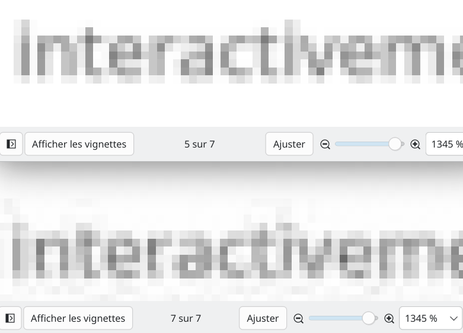

# TP1 - Implémentation DCT/JPEG
18.04.2026

## Objectif
Ce projet implémente une chaîne de compression inspirée de JPEG en niveaux de gris dans [dct-jpeg.py](dct-jpeg.py), puis évalue le compromis entre compression et qualité d'image.


## Principe technique
Le traitement suit les étapes classiques d'un codec JPEG simplifié:
1. L'image est lue puis convertie en niveaux de gris pour travailler sur une seule composante.
2. Un padding est appliqué pour obtenir des dimensions multiples de 8, afin de traiter l'image par blocs 8x8.
3. Chaque bloc est transformé par DCT 2D.
4. La quantification réduit la précision des coefficients, surtout ceux des hautes fréquences.
5. Les coefficients sont parcourus en zigzag, compressés par RLE puis encodés par Huffman.
6. La reconstruction se fait par déquantification puis IDCT.
7. La qualité est mesurée avec le MSE et le PSNR, et la compression avec le gain et le ratio.


## Notions clés
- La DCT concentre l'information utile dans les basses fréquences, généralement en haut à gauche de la matrice.
- Les hautes fréquences représentent surtout les détails fins et les contours.
- La quantification supprime ou arrondit davantage ces hautes fréquences, ce qui réduit la taille mais dégrade l'image.
- Le MSE mesure l'écart moyen entre l'image originale et l'image reconstruite.
- Le PSNR traduit cet écart en une mesure de qualité: plus il est élevé, meilleure est la reconstruction.
- Le gain indique la part d'espace économisée, tandis que le ratio compare directement la taille originale à la taille compressée.


## Résultats (exemple multi-qualités)
Commande utilisée:

```bash
python3 dct-jpeg.py --qualities 1,2,3,4,5,10,15,20,25,30 --main-quality 15
```

Tendance observée:
- Quand `quality` augmente, la quantification est plus forte.
- La taille de l'image diminue
- La qualité diminue (SNR)
- Il n'est pas nécessaire de compresser après 25, qui est un bon compromis compression et qualité


## Figures pertinentes

### 1) Image d'entrée (grayscale)

Cette figure montre l'image de départ après conversion en niveaux de gris et padding.


### 2) Coefficients DCT (visualisation)

On observe clairement la représentation fréquentielle les basses fréquences sont sombres et représentes les zones avec peu de changement de couleur comme le fond blanc de la fenêtre, tandis que les hautes fréquences correspondent aux détails et aux variations rapides de l'image, comme les contours des fenêtres et du texte.


### 3) Coefficients quantifiés

Après quantification, beaucoup de coefficients deviennent petits ou nuls. Cela montre que l'on conserve une petite information essentielle et que l'on élimine une partie des détails. Les basses fréquences vont être privilégiées aux hautes fréquences de l'image


### 4) Image reconstruite

La reconstruction reste proche de l'image d'origine, mais on peut voir des artefacts de compression, surtout sur les zones de texte et les contours. Ici au dessus l'original et en dessous l'image compressée et reconstruite:



### 5) Comparaison original/reconstruction/erreur
![[Pasted image 20260418210538.png]]
Cette figure compare l'original et la reconstruction, puis construis une carte de différences (Mean Square Error). Les écarts apparaissent surtout sur les zones de fort contraste, où la compression est la plus visible. C'est là que la compression, les données qu'on n'a pas gardé, a été la plus forte. On est ici clairement sur l'approche d'une compression à perte, L'oeil humain se concentre sur certains paramêtres de l'image plutôt que d'autres et définis ainsi ce qui vaut la peine d'être conservé ou négligé pour la compression.


### 6) Compromis gain/qualité

Cette courbe montre le compromis classique: plus la compression est forte, plus le gain augmente, mais plus la qualité mesurée par le PSNR diminue. 25 serait la compression la plus forte encore pertinente, augmenter au delà diminue bien trop la qualité pour peu de rendement en compression.


## Conclusion
Le code couvre les briques principales d'un codec JPEG: transformation fréquentielle, quantification, compression entropique et reconstruction. Les figures confirment le comportement attendu d'un tel codec: bonne réduction de taille, mais perte progressive de fidélité quand la quantification augmente.
